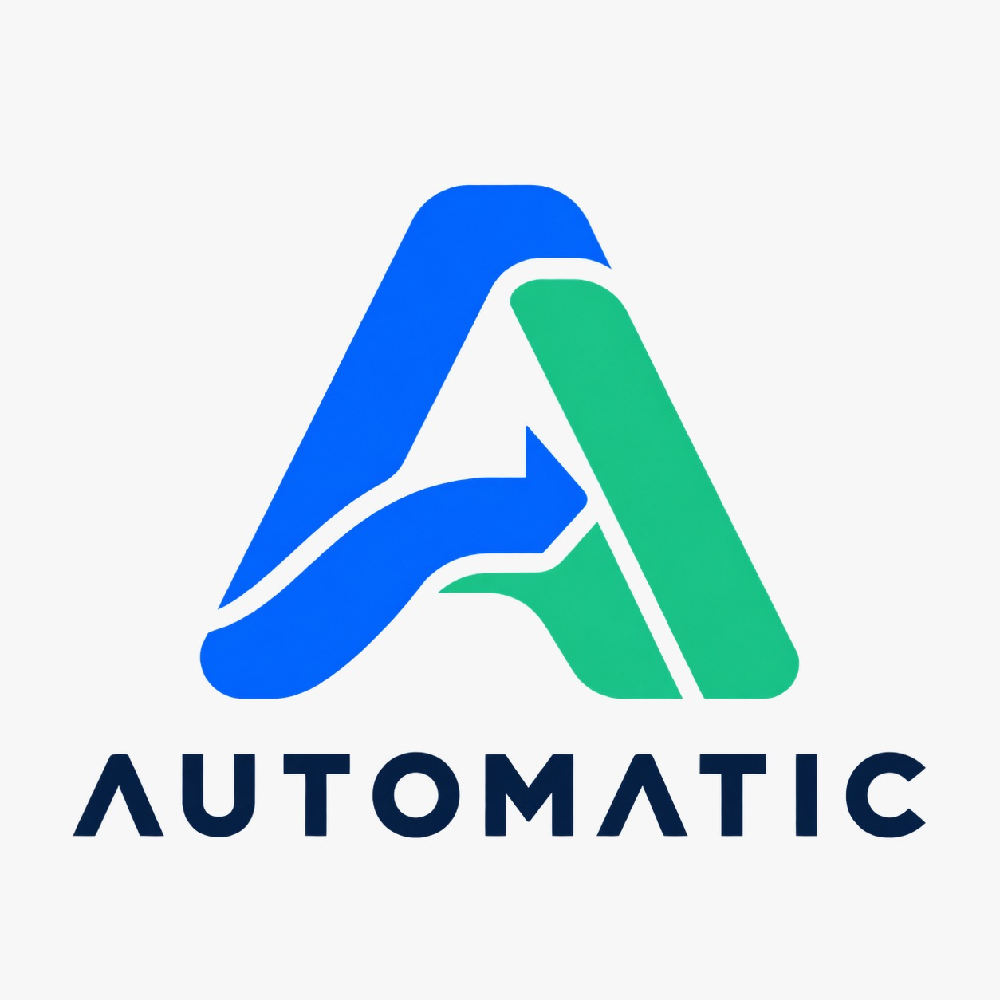
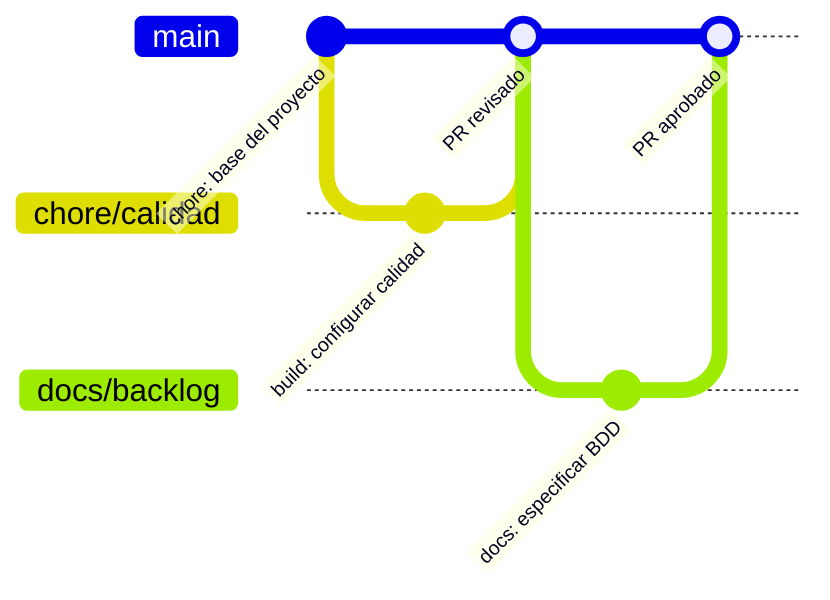

# AgroValle Connect

[](https://github.com/JuanFiligrana/Agrovalle-Conect/actions/workflows/ci.yml)




## Visión del producto
Para los productores del Valle del Cauca que necesitan vender directamente sus cosechas, AgroValle Connect es una plataforma web empresarial en Java 25 y Spring Boot que conecta la oferta agrícola con compradores y comercios de Cali y sus alrededores. A diferencia de la intermediación tradicional, el producto propone información transparente sobre origen, precio y disponibilidad, junto con trazabilidad de los pedidos mediante contratos de API verificables.
=======

## 1. Visión del Producto
Para los productores agrícolas del Valle del Cauca, que necesitan vender sus cosechas de forma directa, AgroValle Connect es una plataforma web en Java, que conecta la oferta agrícola con la demanda comercial urbana a un precio justo. A diferencia de las cadenas con intermediarios tradicionales, nuestro producto garantiza trazabilidad logística y contratos de API transparentes.
>>>>>>> Stashed changes

## Integrantes
- Juan Eduardo Filigrana Mindinero
- Michael David Caicedo Mina
- Juan Camilo Álvarez
- Jhojan Aragón

## Alcance de esta entrega
Sprint 0: infraestructura, documentación y especificación BDD. La aplicación incluye
una portada web y GET `/api/v1/estado`. Las 15 historias de negocio son el backlog futuro;
no se declara implementado el registro, el catálogo, los pedidos, JWT ni PostgreSQL.
El driver PostgreSQL está disponible para la próxima etapa, sin conexión activa ni
credenciales. No hace falta una base de datos para iniciar esta base.

## Ejecutar en Windows
1. Extraer el ZIP y abrir esta carpeta completa, donde está pom.xml.
2. Ejecutar `iniciar.cmd`. Busca un JDK 25 ya instalado en ubicaciones comunes o JAVA_HOME,
   lo selecciona para esa ejecución y muestra la dirección a abrir.
3. Al ver `Started AgrovalleApplication`, abrir http://localhost:8081/.
4. Conservar la terminal abierta. Ctrl+C detiene la aplicación.

Si el puerto 8081 está ocupado, ejecutar `iniciar.cmd 8082` y abrir localhost:8082.
Si solo está instalado otro Java, instalar JDK 25 desde una distribución oficial.
El iniciador no desinstala Java ni cambia variables globales.
Maven Enforcer exige JDK 25: compilar con target 25 usando otra JVM no sustituye ese requisito.

### Comandos directos
Con JAVA_HOME apuntando al JDK 25, en PowerShell:
```powershell
.\mvnw.cmd clean verify
.\mvnw.cmd spring-boot:run
```
En Linux o Git Bash: `sh ./mvnw clean verify` y `sh ./mvnw spring-boot:run`.
El Wrapper descarga Maven 3.9.9; la primera ejecución requiere Internet.

## Calidad local
Con Git, Node.js 18 o posterior y JDK 25 instalados, dentro del repositorio clonado:
```powershell
npm.cmd ci
git config --get core.hooksPath
```
El resultado esperado es `.husky/_`. En una carpeta sin .git, primero hay que integrar
los archivos al repositorio siguiendo [la guía de GitHub](docs/github.md).
El hook ejecuta `sh ./mvnw -B test checkstyle:check`. Checkstyle también corre en validate.
Husky detecta fallos antes del commit y Checkstyle impone un estilo uniforme; así se
reduce el trabajo de corrección que se acumularía como deuda técnica.
`verify` agrega empaquetado y el umbral JaCoCo de 60 %; reporte en target/site/jacoco/index.html.

## Estrategia de ramas
El equipo propone Trunk-Based Development con ramas de tarea cortas y Pull Requests hacia main. Para cuatro integrantes y una sola versión académica activa, reduce las ramas de integración que deben mantenerse. Las tareas pequeñas, la sincronización frecuente y la revisión de un compañero antes del merge reducen esperas y conflictos. No se programa directamente sobre main después de la inicialización. La elección no elimina por sí sola los conflictos: requiere disciplina y controles de integración.



El diagrama representa el flujo acordado, no pruebas de PR ya aprobados. Las ramas de
funcionalidad se nombran `feature/HU-XX-descripcion`; documentación usa `docs/` y tareas
iniciales `chore/`. Las mejoras se integran mediante PR, no mediante push directo a main.

## Conventional Commits
- `chore: inicializar estructura del proyecto`
- `build: configurar Maven y controles de calidad`
- `test: comprobar estado y portada web`
- `docs: especificar backlog y contrato de calidad`
- `feat(productos): publicar ofertas agrícolas` se usará cuando esa función exista.

## Contrato y documentos
- [BACKLOG.md](BACKLOG.md): 15 historias, 40 escenarios y 76 puntos propuestos.
- [Definition of Done](docs/dod.md): checklist y aceptación por los cuatro integrantes.
- [Estimación](docs/estimacion.md): procedimiento y registro de Planning Poker.
- [Arquitectura](docs/arquitectura.md): capas y límites del Sprint 0.
- [Integración en GitHub](docs/github.md): ramas, commits, PR, revisión y checks.
- [Verificación](docs/verificacion.md): resultados comprobados y límites.
- [Matriz de requisitos](docs/matriz-requisitos.md): correspondencia con las guías.

## Integración continua
El workflow `.github/workflows/ci.yml` ejecuta `verify` con Java 25 en pushes a main
y en Pull Requests hacia main. El badge refleja una ejecución remota solo después
de publicar el workflow. Configurar protección de main con al menos una aprobación
externa al autor y check build obligatorio. Un workflow por sí solo no bloquea merges
si la protección no está configurada. No se incluye despliegue de staging en Sprint 0.

## Estructura
- src/main/java/co/edu/uniajc/agrovalle/models: contratos de datos.
- src/main/java/co/edu/uniajc/agrovalle/controllers: controladores REST.
- src/main/resources/static: vista web.
- src/main/views: documentación de la capa de vistas.
- src/test/java: pruebas automatizadas.
- docs: decisiones, calidad y evidencias.

## Fuentes
Guías oficiales de Paola Andrea Bedoya Toro: Proyecto integrador AgroValle Connect;
Guía de Trabajo Práctico V2; Flujo de Trabajo Profesional en Git y GitHub.
[Spring Boot](https://docs.spring.io/spring-boot/3.5/system-requirements.html),
[Husky](https://typicode.github.io/husky/get-started.html),
[Checkstyle Google Java Style](https://github.com/checkstyle/checkstyle/blob/checkstyle-10.21.4/src/main/resources/google_checks.xml).
