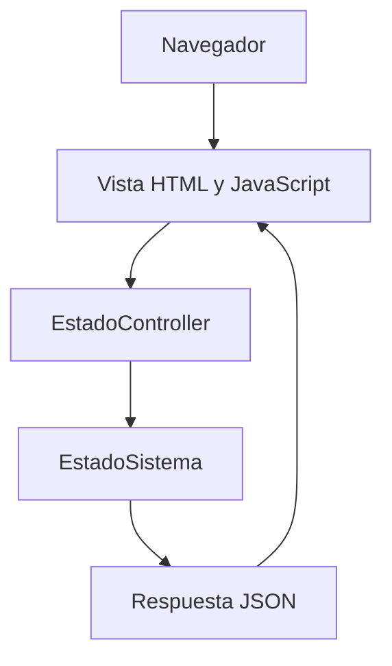

# Arquitectura y alcance técnico

Java 25 y Spring Boot 3.5.16 con Maven Wrapper 3.9.9. La clase de arranque configura
el servidor web. EstadoController expone GET /api/v1/estado y devuelve el record
EstadoSistema como JSON. La vista HTML estática vive en resources/static. No existe
lógica de negocio, persistencia ni autenticación todavía.

Los paquetes models y controllers separan datos y solicitudes; la vista se sirve desde
la ubicación estándar de Spring Boot. src/main/views documenta esa decisión. La base
es ampliable a servicios y repositorios cuando las historias requieran lógica y datos.

## Decisiones
- PostgreSQL es la base relacional prevista; incluir su driver no equivale a conectarla.
- Repository, Factory y Observer se evaluarán e implementarán cuando exista el caso de
  uso correspondiente. Spring administra componentes compartidos por defecto; no se
  crea un Singleton manual ni se afirma aplicar patrones sin necesidad real.
- Mockito usa mock-maker-subclass en tests para evitar adjuntar un agente dinámico a
  la JVM. No permite simular clases finales; revisar esta elección cuando se necesiten.
- El puerto predeterminado es 8081 por el conflicto local detectado con 8080. Se puede
  cambiar con PORT o --server.port. No se termina ningún otro proceso automáticamente.

## Funcionalidades futuras
El backlog define contratos REST propuestos. PostgreSQL, JWT, transacciones y estados
son requisitos para próximos incrementos, no capacidades que esta base ya ofrezca.
El primer pedido será de un solo agricultor. No hay pagos reales ni GPS continuo.
