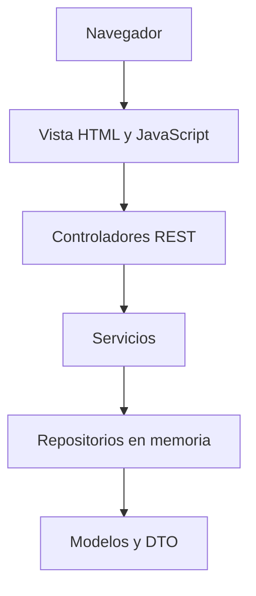

# Arquitectura y alcance técnico

Java 25 y Spring Boot 3.5.16 con Maven Wrapper 3.9.9. La clase de arranque configura
el servidor web. Los controladores reciben DTO validados y delegan las reglas a
servicios; los repositorios en memoria conservan el estado durante la ejecución.
La vista HTML estática vive en resources/static. EstadoController conserva el
endpoint de salud del Sprint 0.

Los paquetes separan controladores, DTO, servicios, repositorios y modelos; la vista se
sirve desde la ubicación estándar de Spring Boot. src/main/views documenta esa
decisión. La persistencia en memoria permite demostrar el flujo completo sin exigir
credenciales locales de PostgreSQL.

## Decisiones
- PostgreSQL es la base relacional prevista; incluir su driver no equivale a conectarla.
- Repository, Factory y Observer se evaluarán e implementarán cuando exista el caso de
  uso correspondiente. Spring administra componentes compartidos por defecto; no se
  crea un Singleton manual ni se afirma aplicar patrones sin necesidad real.
- Mockito usa mock-maker-subclass en tests para evitar adjuntar un agente dinámico a
  la JVM. No permite simular clases finales; revisar esta elección cuando se necesiten.
- El puerto predeterminado es 8081 por el conflicto local detectado con 8080. Se puede
  cambiar con PORT o --server.port. No se termina ningún otro proceso automáticamente.

## Funcionalidades futuras
El backlog conserva contratos BDD para las 15 historias. PostgreSQL, JWT validado,
transacciones y estados de pedido son requisitos para próximos incrementos; el Sprint 1
usa repositorios en memoria para demostrar el primer flujo funcional.
El primer pedido será de un solo agricultor. No hay pagos reales ni GPS continuo.
